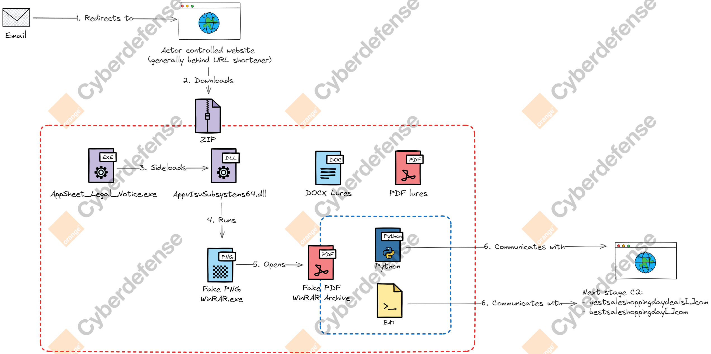

🎣🧀 Since early September 2025, the Orange Cyberdefense CSIRT and CyberSOC teams have detected phishing campaigns impersonating Meta, AppSheet and Paypal, leading to malware delivery. Our team tracks this activity under the alias "Metappenzeller".

✨ AppSheet is a Google platform that enables no-code development of mobile, tablet, and web applications. Knowbe4, RavenMail, and MalwareHunterTeam have also previously mentioned such campaigns.
https://x.com/i/web/status/1965024327268766078
https://ravenmail.io/blog/appsheet-phishing-scam
https://blog.knowbe4.com/impersonating-meta-powered-by-appsheet-a-rising-phishing-campaign-exploits-trusted-platforms-to-evade-detection

✉ The campaigns are initiated from the legitimate noreply[@]appsheet.com address and deliver various payloads, with lures targeting corporate sales, marketing, and legal teams. We advise to hunt for emails from this sender.

☣ The main lure deploys a full Python environment and runs a Python script to fetch the next stage from a remote C2. Then it opens a decoy file in Word. C2's are now inactive, but have been likewise tied to Pure malware family.

# IoCs

| IoCs                                                             | Comment                                    |
| ---------------------------------------------------------------- | ------------------------------------------ |
| bestsaleshoppingdaydeals.com                                     | C2 Domain                                  |
| bestsaleshoppingday.com                                          | C2 Domain                                  |
| https://goo[.]su/I23iS                                           | Email URL                                  |
| https://goo[.]su/TnTSt/                                          | Email URL                                  |
| https://goo[.]su/dFj632j                                         | Email URL                                  |
| 4d30c089bb8421342ec19ee146b73a251985146b0be7d4412a77c81c388ad802 | Main archive (`AppSheet_Legal_Notice.zip`) |
| 787c26ef662b20d8a6daea187a6cad9401af5d6f84ad77f4fb24fdae6f37e92f | Malicious DLL (`AppvIsvSubsystems64.dll`)  |
| https://namchask[.]online/appsheet/                              | Delivery URL                               |
| 9679bee0656e                                                     | Mutex created                              |

