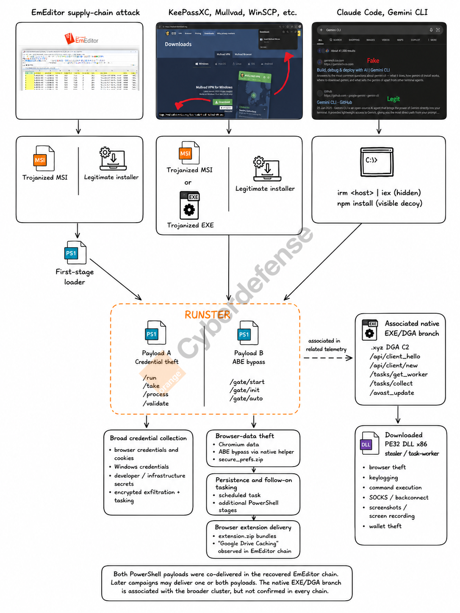

# Runster 


> **Update (2026-06-17):** our related "Payload C" is ***likely*** tied to MetaStealer and was recently [detailed](https://www.huntress.com/blog/potemkin-loader-rmmproject-clickfix-attack) by Huntress, which named it **Potemkin loader**. Another blog by Walmart on this new DGA is available [here](https://medium.com/walmartglobaltech/metastealer-traffic-new-dgas-and-analyzing-the-tracker-backdoor-dga-with-ai-96ea63dc7c01).
> 

---

Orange Cyberdefense CERT has been tracking a previously unnamed modular stealer-loader framework we call **Runster**, active since at least November 2025. Two main delivery methods. Two PowerShell modules stealing data. A third, related executable with a DGA component dropping a full-featured DLL.


*RUNSTER delivery and modular architecture — Orange Cyberdefense*

**RUNSTER** refers to the recurring use of the `/run` URL path pattern in C2 communication, and to the delicious Munster Alsatian cheese, in line with our cheese-based naming convention.

Our investigation started after EclecticIQ(https://blog.eclecticiq.com/seo-poisoning-campaign-leverages-gemini-and-claude-code-impersonation-to-deliver-infostealer), building on [@g0njxa](https://x.com/g0njxa/status/2041636371790495798/), and [Ontinue](https://www.ontinue.com/resource/blog-behind-a-fake-claude-code-installer/) independently documented campaigns with overlapping infrastructure at `events.msft23[.]com`.

---

## Delivery

- **EmEditor supply-chain compromise** (Dec 2025): trojanized MSI served directly from the vendor's download path
- **SEO poisoning and malicious ads**: fake download pages impersonating KeePassXC, Mullvad VPN, WinSCP and others; InstallFix-style lures impersonating Claude Code and Gemini CLI

---

## Payloads

### Payload A: Credential theft via `/run/<token>`

- Suppresses PowerShell ETW telemetry, bypasses AMSI, and terminates if a virtual machine is detected (`qemu-ga`)
- Browser data and Windows Credential Manager
- Slack, Teams, Discord and Telegram
- SSH, OpenVPN, OAuth and CI/CD tokens
- Cryptocurrency wallets

### Payload B: Browser-data theft via `/gate/start/<token>`

- Geofences CIS countries and Iran
- Injects a native PE helper into Chromium browsers and uses IElevator2 COM to recover a 32-byte App-Bound Encryption key
- Packages collected data as `secure_prefs.zip` → PUT `/gate/init/`
- Persists through a scheduled task and polls `/gate/auto/` for follow-on PowerShell stages

### Payload C: EXE/DGA loader (***likely*** MetaStealer / Potemkin loader)

Two DGA variants confirmed:

- Char-based: `[a-z]{16}.xyz` (seed `0xD01B`)
- Wordlist-based: `word1[-]word2[-]word3.xyz` (seed `0x2507E`)

C2 flow: `/api/client_hello` → `/avast_update` → `/api/client/new` → `/tasks/get_worker` → `/tasks/collect`

### Payload D: Stealer / task-worker DLL (via `/avast_update`)

Browser theft, keylogging, HVNC, SOCKS/backconnect, shell command execution, file theft, screenshots, screen recording, wallet theft.

---

## Evidence connecting the campaigns

- Recurring C2 path conventions (`/run/`, `/gate/`, `/api/client_*`)
- Infrastructure overlaps — shared IPs, redirect fingerprint, domain naming patterns
- Code-level similarities across PowerShell samples
- Co-delivery confirmed in the EmEditor campaign: both PowerShell modules delivered simultaneously via RunspacePool

---

## Assessment

The two PowerShell modules are ***highly likely*** part of the same cluster and ***likely*** share a source lineage or common toolchain. The `/gate/*` geofencing covering CIS countries and Iran suggests a possible CIS nexus. We do not attribute Runster to a known threat actor at this time.

---

## Detection

Monitor outbound HTTP(S) requests for:

```
# PowerShell profiles
/run/[A-Za-z0-9]{8}
/(take|process|validate)/[A-Za-z0-9]{8}
/gate/(start|init|auto)/[A-Za-z0-9]{8}

# Loader
/api/client_hello
/api/client/verify
/avast_update
/tasks/get_worker
/tasks/collect
```

On endpoints, hunt for:
- Hidden `irm <host> | iex` execution following installer activity
- `secure_prefs.zip` in temporary paths
- Scheduled tasks launching `conhost --headless powershell` (PT1M)
- `%LocalAppData%\hyper-v.ver`
- `Add-MpPreference` exclusions for unexpected paths
- HTTP User-Agent `cpp-httplib/0.12.1`

---

## Further reading

A full advisory is available to Orange Cyberdefense Strategic CTI customers.  
IOC list: [iocs.md](iocs.md)

---

## Acknowledgements

Thanks to Trend Micro for feedback on this cluster.

Public reporting by @g0njxa, EclecticIQ, Ontinue, Stormshield, Qianxin and ReversingLabs contributed to this investigation.

Led by CTI analysts Asma Lansari and Simon Vernin, with reverse engineering by Alexis Bonnefoi.
